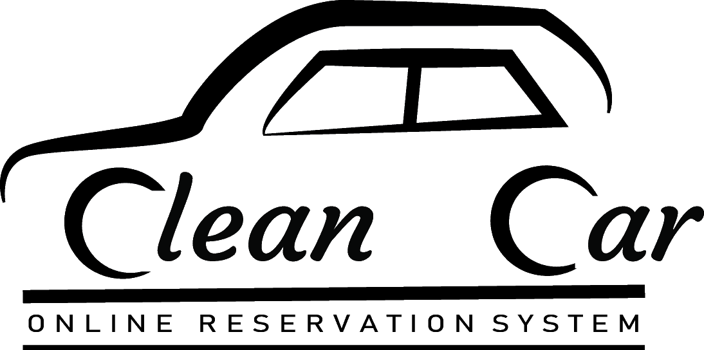

### Stats




# Clean-Car

A Repository made for 2nd year group project:
All is in code folder

## Steps for deploy:

1. Copy the contents of the  repo into your localhost system. (Xampp, Wamp etc.)
2. Import the `CLEANCAR_FINAL.sql` dump file in the [database/](database) directory to a newly created database in your system named as `cleancar`. 


3. Change the  existing content of [Cleancar/code/app/lib/Database.php /](Cleancar/code/app/lib/Database.php /) as desired to :

```php
$host='localhost';
$username='YOUR_USERNAME';
$password='YOUR_PASSWORD';
$db='cleancar';
```

## Feedback:

This was a project done with 0 experience on development :stuck_out_tongue: feedback and issue pointing is more than welcome :pray: !

